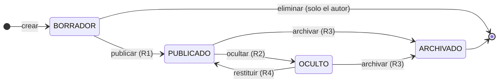
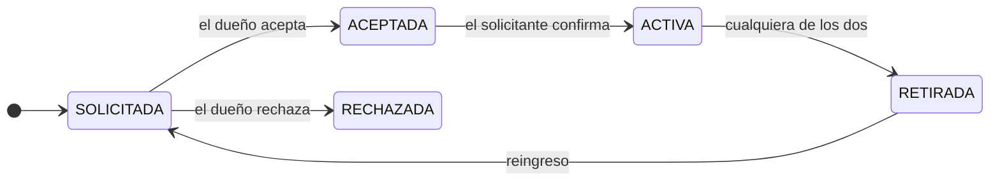

# Proceso principal: ciclo de vida de una publicación

El §2.2 pide documentar el proceso principal con **al menos tres estados y validaciones
de reglas de negocio**. En DevNet ese proceso es el recorrido de una publicación desde
que su autor la redacta hasta que deja de estar visible.

No es un CRUD: hay una máquina de estados con transiciones restringidas, reglas que
dependen del rol y de la propiedad del recurso, y un historial que debe escribirse en la
misma transacción que el cambio.

> **Nota de alcance (2026-09-18).** Este documento describía antes el ciclo completo de
> moderación —reportes, revisión, apelaciones y suspensiones automáticas, reglas R1 a
> R7—, que suponía un módulo `moderation` que no llegó a construirse. Lo que sí existe es
> el ciclo de la publicación y la acción de ocultar, implementada dentro de `project`. El
> resto se retiró en lugar de dejarlo descrito como si funcionara.

> Nomenclatura: *publicación* es el supertipo que abarca **proyectos** y **discusiones**.
> Solo los proyectos tienen implementación; la especialización está en el
> [modelo lógico](../bd/02-modelo-logico.md).

---

## Máquina de estados

Los estados son los que admite `ck_publicacion_estado` en
[`V1__baseline.sql`](../../src/main/resources/db/migration/V1__baseline.sql).

La restricción incluye además `EN_REVISION`, que pertenecía al flujo de reportes.
**Hoy ninguna transición lo alcanza.** Se conserva en el CHECK para no forzar una
migración que quitaría un valor que quizá vuelva a hacer falta, y se documenta aquí como
estado sin uso para que nadie lo busque en el código.

| Estado | Visible al público | Editable por el autor | Comentable |
|---|---|---|---|
| `BORRADOR` | No, solo su autor | Sí | No |
| `PUBLICADO` | Sí | Sí | Sí |
| `OCULTO` | No, solo su autor y los moderadores | No | No |
| `ARCHIVADO` | No | No | No |
| `EN_REVISION` | — | — | — *(sin uso)* |

---

## Reglas

### R1 · Publicar un borrador

Implementada en
[`PublicarProyecto`](../../src/main/java/com/codefactory/devnet/project/application/PublicarProyecto.java)
(HU-07, AB#17).

Condiciones, todas verificadas en el servidor:

1. Hay sesión activa. Sin ella, `ACCESO_DENEGADO`.
2. **Solo el autor publica en su nombre.** El identificador del autor sale del token, no
   del cuerpo de la petición: aceptarlo del cliente permitiría publicar suplantando a
   otro.
3. El título mide entre 5 y 200 caracteres una vez recortado.
4. La descripción tiene al menos 20 caracteres.
5. El permiso `publicacion:crear` está en el token. Lo conceden `DESARROLLADOR`,
   `MODERADOR` y `ADMIN`.
6. Las tecnologías declaradas existen en el catálogo y están aprobadas.

Si algo falla se responde con el cuerpo de error del ADR-005, con el detalle por campo, y
no se escribe nada.

### R2 · Ocultar una publicación

Implementada en
[`OcultarPublicacion`](../../src/main/java/com/codefactory/devnet/project/application/OcultarPublicacion.java)
(HU-06, AB#15, criterio 2).

- Exige el permiso `publicacion:moderar`, que solo tienen `MODERADOR` y `ADMIN`. Un
  desarrollador recibe 403 **y el intento queda registrado en auditoría**.
- El motivo es obligatorio y necesita **al menos 20 caracteres**. No hay resolución
  silenciosa: retirar contenido ajeno se justifica por escrito, y ese texto queda en el
  historial por si más adelante hay que revisarlo.
- La transición y la escritura del historial ocurren en la misma transacción (R5).

Esta regla es todo lo que sobrevive del módulo de moderación previsto. Reportar
contenido, revisar una cola de reportes, apelar una ocultación y suspender cuentas
automáticamente **quedaron fuera del alcance**; el javadoc de `OcultarPublicacion` lo
dice explícitamente.

### R3 · Archivar

El autor retira definitivamente su publicación. Es **terminal e irreversible**: de
`ARCHIVADO` no se sale. Se distingue del borrado en que conserva el rastro —comentarios,
reacciones y reputación acreditada siguen siendo coherentes— sin dejar el contenido
visible.

### R4 · Restituir

Un moderador devuelve a `PUBLICADO` algo que se ocultó por error. Mismo permiso que R2 y
también con motivo.

### R5 · Toda transición deja rastro

Cada cambio de estado escribe una fila en `historial_estado_publicacion` con el estado
anterior, el nuevo, quién lo hizo y por qué, **en la misma transacción que el cambio**.
Si el historial no se puede escribir, la transición no ocurre. El comentario de la tabla
en `V1__baseline.sql` lo declara así.

`ck_historial_estados_distintos` impide registrar una transición de un estado a sí mismo,
que sería ruido.

Es lo que exige el §3.2 —«implementar auditoría y trazabilidad de cambios relevantes»— y
lo que permite contestar la pregunta que se hace cuando alguien reclama: quién ocultó
esto, cuándo y con qué motivo.

---

## Colaboración en un proyecto

> **Modelado en base de datos, sin implementación.** La tabla `colaboracion` está en
> `V1__baseline.sql` con su máquina de estados y su restricción de unicidad, y cuenta
> como entregable de modelado (§3.2). No hay código que la use.

El detalle que importa: `ux_colaboracion_proyecto_usuario` es única sobre
`(publicacion_proyecto_id, usuario_id)`, de modo que **el reingreso tras un retiro
transiciona la fila existente en vez de crear otra**. Sin esa unicidad, alguien podría
acumular solicitudes repetidas sobre el mismo proyecto y el dueño recibiría la misma
petición una y otra vez.

---

## Trazabilidad

| Regla | Historia | Implementación | Verificación |
|---|---|---|---|
| R1 | HU-07 · AB#17 | `PublicarProyecto` | `ProyectoTest`, `PublicarProyectoIT` |
| R2 | HU-06 · AB#15 | `OcultarPublicacion` | `ControlAccesoPorRolIT` |
| R3 | — | No implementada | — |
| R4 | — | No implementada | — |
| R5 | HU-06 · AB#15 | `historial_estado_publicacion` | `ControlAccesoPorRolIT` |