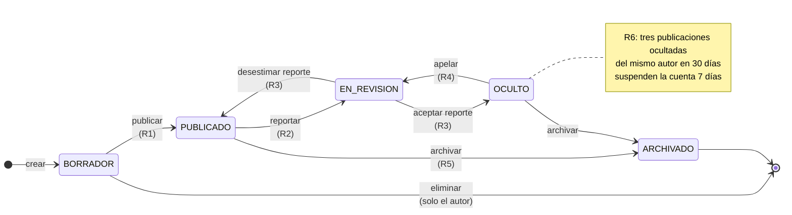
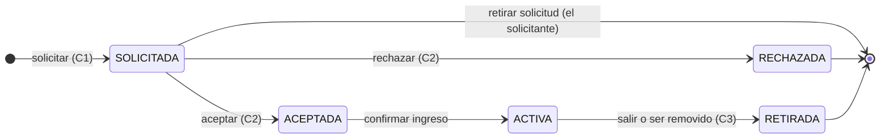

# Proceso principal: ciclo de vida de una publicación con moderación

Este es el proceso que sostiene la arquitectura y el modelo de datos. Se eligió entre los
candidatos del caso porque es el único que cumple simultáneamente tres condiciones:
tiene más de tres estados, sus transiciones están gobernadas por reglas de negocio que no
se reducen a operaciones CRUD, y involucra a los tres roles del sistema.

> Nomenclatura: *publicación* es el supertipo que abarca **proyectos** y **discusiones**.
> Ambos comparten estados, comentarios, reacciones y moderación. Ver
> [modelo lógico](../bd/02-modelo-logico.md), sección de especialización.

---

## Máquina de estados

Estados y su significado:

| Estado | Visible para | Editable | Admite comentarios |
|---|---|---|---|
| `BORRADOR` | Solo el autor | Sí, por el autor | No |
| `PUBLICADO` | Todos | Sí, por el autor | Sí |
| `EN_REVISION` | Autor y moderadores | No | No se admiten nuevos |
| `OCULTO` | Autor y moderadores | No | No |
| `ARCHIVADO` | Todos, solo lectura | No, inmutable | No se admiten nuevos; los existentes siguen legibles |

---

## Reglas de negocio

Estas reglas son la razón por la que el proyecto no es un CRUD. Cada una se implementa en
el `domain` del módulo correspondiente y lleva prueba unitaria propia.

### R1 — Publicar un borrador

Se permite únicamente si se cumplen **todas** las condiciones:

1. Quien publica es el autor. No hay excepción, ni siquiera para administradores.
2. El autor tiene su **identidad de GitHub vinculada** (perfil verificado). Esto reemplaza
   la verificación por correo; ver [ADR-004](../adr/ADR-004-identidad-propia-github-oidc.md).
3. El autor declaró **al menos una tecnología** en su perfil.
4. La publicación tiene **al menos una y máximo cinco** tecnologías etiquetadas.
5. El autor **no está suspendido**.
6. Si es una discusión, el autor tiene **reputación ≥ 10**. Si es un proyecto, no hay
   umbral: publicar el propio trabajo no debe estar condicionado a la reputación.

Si falla la 1 → `403`. Si fallan 2, 3, 5 o 6 → `422`. Si falla la 4 → `400`.
Ver el mapa completo en [ADR-005](../adr/ADR-005-contrato-errores-traceid.md).

### R2 — Reportar contenido

- Solo usuarios autenticados con reputación ≥ 5, para evitar el reporte como herramienta
  de acoso desde cuentas recién creadas.
- El autor no puede reportar su propia publicación.
- Un mismo usuario no puede reportar dos veces la misma publicación mientras haya un
  reporte abierto sobre ella.
- El primer reporte mueve la publicación a `EN_REVISION`. Los reportes siguientes se
  acumulan sobre el mismo expediente sin volver a transicionar.

### R3 — Resolver un reporte

- Solo un usuario con el permiso `publicacion:moderar` y **con MFA inscrito**.
- El moderador que resuelve debe ser **distinto del reportante** y **distinto del autor**.
  Esta es la regla ABAC más característica del sistema: no basta el rol, el contexto de la
  relación decide.
- La resolución exige un motivo escrito de mínimo 20 caracteres. No hay resolución
  silenciosa.
- Aceptar el reporte → `OCULTO`. Desestimarlo → `PUBLICADO`.

### R4 — Apelar una ocultación

- Solo el autor, y solo una vez por publicación.
- Dentro de los 15 días siguientes a la ocultación.
- La apelación debe resolverla un moderador **distinto del que ocultó**.

### R5 — Archivar

- Por el autor en cualquier momento desde `PUBLICADO`, o por un moderador desde `OCULTO`.
- El archivado es **terminal e irreversible**. La publicación queda inmutable.
- Los comentarios existentes permanecen legibles: el archivado preserva la conversación,
  no la borra. Preservar el registro histórico es una decisión consciente del dominio.

### R6 — Suspensión automática

Cuando una publicación entra en `OCULTO`, el módulo de moderación cuenta las publicaciones
del mismo autor ocultadas en los últimos 30 días. Si llega a **tres**, se suspende la
cuenta por **7 días** de forma automática.

Durante la suspensión el usuario puede leer, pero no publicar, comentar, reaccionar ni
enviar mensajes. La suspensión queda en `suspension` con `automatica = true` y
`aplicada_por = NULL`, de modo que se distingue en auditoría de una sanción manual.

### R7 — Trazabilidad de transiciones

**Toda** transición de estado escribe una fila en `historial_estado_publicacion` con
estado anterior, estado nuevo, actor, motivo y marca de tiempo, dentro de la misma
transacción que el cambio de estado. Si el historial no se puede escribir, la transición
no ocurre.

Esto es lo que hace auditable el proceso y da cuerpo a la exigencia de §3.2 de "implementar
auditoría y trazabilidad de cambios relevantes".

---

## Segundo flujo con reglas no triviales: solicitud de colaboración

- **C1** — Solo sobre proyectos `PUBLICADO` con `busca_colaboradores = true`. El dueño no
  puede solicitar colaborar en su propio proyecto. No se admite una segunda solicitud si
  ya existe una en curso.
- **C2** — Solo el dueño del proyecto resuelve. Si el proyecto ya alcanzó
  `max_colaboradores` activos, la aceptación se rechaza con `422`.
- **C3** — Tras `RETIRADA` no hay reingreso por solicitud propia; solo por invitación
  directa del dueño. Esto evita el ciclo de salir y volver a entrar para eludir sanciones
  dentro del proyecto.
- **C4** — Si el dueño desactiva su cuenta, la propiedad del proyecto se transfiere al
  colaborador activo más antiguo; si no hay ninguno, el proyecto pasa a `ARCHIVADO`.

---

## Tercer bloque: reputación como habilitador de privilegios

La reputación no es un adorno social: **condiciona lo que un usuario puede hacer**, y por
eso es regla de negocio y no una métrica.

| Evento | Puntos |
|---|---|
| Recibe una reacción en una publicación | +2 |
| Recibe una reacción en un comentario | +1 |
| Su comentario es marcado como respuesta aceptada | +15 |
| Publica un proyecto con repositorio vinculado | +5 |
| Una publicación suya pasa a `OCULTO` | −20 |
| Recibe una suspensión | −50 |

| Privilegio | Reputación mínima |
|---|---|
| Comentar y reaccionar | 0 |
| Reportar contenido | 5 |
| Abrir una discusión | 10 |
| Enviar un mensaje privado a alguien que no te sigue | 25 |

La reputación se modela como **libro mayor de eventos** (`evento_reputacion`), no como un
contador que se incrementa. El saldo en `perfil.reputacion` es una denormalización
justificada por lectura —se consulta en cada elemento del feed— y siempre se puede
reconstruir sumando el libro mayor. Esa reconstrucción es, además, la prueba de integridad
del módulo.

---

## Trazabilidad con las historias de usuario

Las historias de usuario las mantiene el equipo en Azure DevOps. Esta tabla se completa con
los identificadores reales (`AB#<id>`) para cerrar la trazabilidad que exige §4.3.

| Regla | Módulo | Endpoint | Tablas | HU |
|---|---|---|---|---|
| R1 | `project`, `discussion` | `POST /api/v1/publicaciones/{id}/publicacion` | `publicacion`, `publicacion_tecnologia`, `historial_estado_publicacion` | `AB#___` |
| R2 | `moderation` | `POST /api/v1/publicaciones/{id}/reportes` | `reporte_moderacion`, `publicacion` | `AB#___` |
| R3 | `moderation` | `POST /api/v1/reportes/{id}/resolucion` | `reporte_moderacion`, `publicacion`, `historial_estado_publicacion` | `AB#___` |
| R4 | `moderation` | `POST /api/v1/publicaciones/{id}/apelacion` | `reporte_moderacion`, `historial_estado_publicacion` | `AB#___` |
| R5 | `project`, `discussion` | `POST /api/v1/publicaciones/{id}/archivado` | `publicacion`, `historial_estado_publicacion` | `AB#___` |
| R6 | `moderation`, `identity` | — (efecto de R3) | `suspension`, `auditoria` | `AB#___` |
| C1–C4 | `project` | `POST /api/v1/proyectos/{id}/colaboraciones` | `colaboracion`, `publicacion_proyecto` | `AB#___` |
| Reputación | `interaction`, `profile` | — (efecto de reacciones y aceptación) | `evento_reputacion`, `perfil` | `AB#___` |