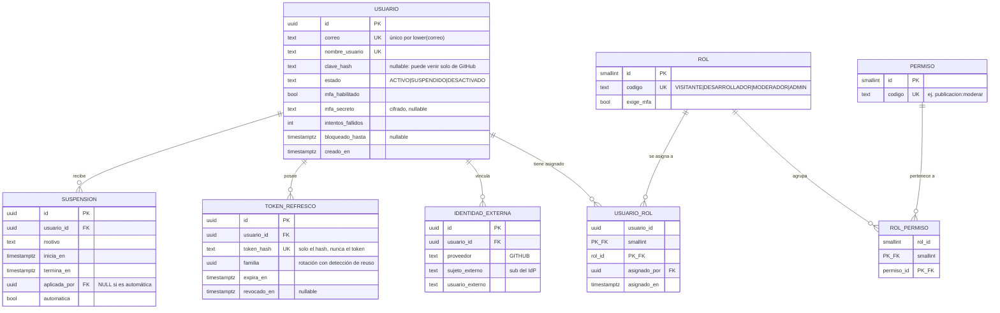
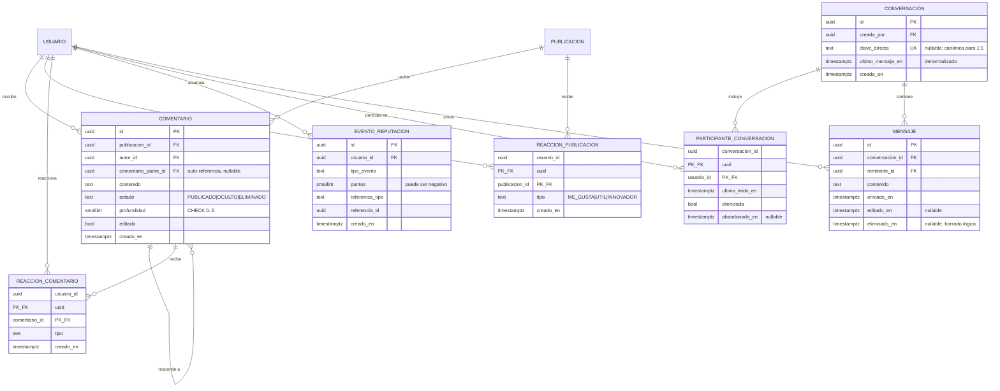
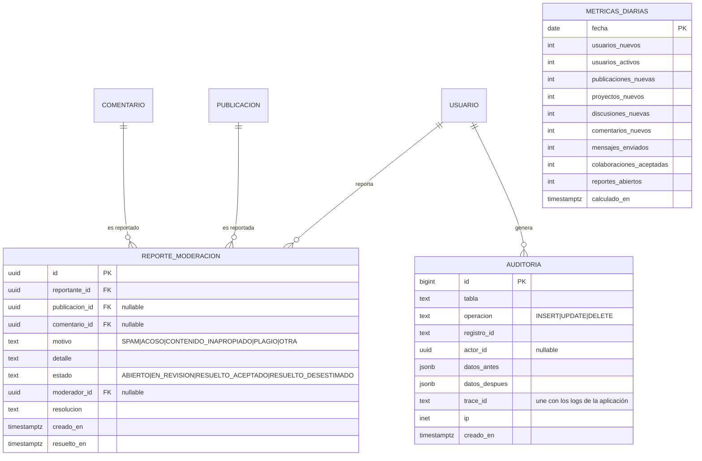

# Modelo lógico — DevNet

Entregable de Sprint 1 (§3.7, Bases de Datos). El modelo responde a las
[preguntas clave](01-consultas-clave.md) y se materializa en
[`V1__baseline.sql`](../../backend/src/main/resources/db/migration/V1__baseline.sql).

**29 tablas en cinco agrupaciones.** Se presenta dividido por dominio porque un diagrama
único de 29 entidades no se lee; las relaciones entre agrupaciones están señaladas en cada
sección.

---

## 1. Identidad y acceso



Notas de diseño:

- **Permisos, no roles, en la autorización.** `@PreAuthorize` evalúa códigos de permiso
  resueltos desde `rol_permiso`. Cambiar qué puede hacer un moderador es una fila, no un
  despliegue.
- **`rol.exige_mfa`** hace que la obligación de segundo factor sea dato y no condicional
  en el código. `MODERADOR` y `ADMIN` la tienen en `true`.
- **`token_refresco.familia`** es lo que permite revocar en cascada ante reuso de un token
  ya consumido. Ver [ADR-004](../adr/ADR-004-identidad-propia-github-oidc.md).
- **`suspension.aplicada_por IS NULL`** distingue la sanción automática de la manual sin
  necesidad de un usuario "sistema" ficticio.
- `usuario.estado` no incluye `PENDIENTE_VERIFICACION`: la verificación se resuelve
  vinculando GitHub, lo que elimina la dependencia de un proveedor de correo.

---

## 2. Perfiles técnicos y grafo social

```mermaid
erDiagram
    USUARIO ||--|| PERFIL : "tiene"
    PERFIL ||--o{ PERFIL_TECNOLOGIA : "declara"
    TECNOLOGIA ||--o{ PERFIL_TECNOLOGIA : "es declarada en"
    USUARIO ||--o{ SEGUIMIENTO : "sigue a"
    USUARIO ||--o{ SEGUIMIENTO : "es seguido por"

    PERFIL {
        uuid usuario_id PK_FK "1:1 identificante"
        text nombre_completo
        text titular
        text biografia
        text ubicacion
        text url_avatar
        text url_sitio_web
        smallint anios_experiencia
        bool disponible_colaborar
        int reputacion "denormalizado, ver nota"
    }
    TECNOLOGIA {
        smallint id PK
        text nombre UK
        text slug UK
        text categoria "LENGUAJE|FRAMEWORK|BASE_DATOS|HERRAMIENTA|CLOUD|OTRA"
        bool aprobada "moderador aprueba las propuestas"
    }
    PERFIL_TECNOLOGIA {
        uuid usuario_id PK_FK
        smallint tecnologia_id PK_FK
        text nivel "BASICO|INTERMEDIO|AVANZADO|EXPERTO"
        smallint anios
    }
    SEGUIMIENTO {
        uuid seguidor_id PK_FK
        uuid seguido_id PK_FK
        timestamptz creado_en
    }
```

Notas de diseño:

- **`perfil` separada de `usuario` en 1:1.** No es normalización redundante: separa el
  dato de autenticación (sensible, de acceso restringido, consultado en cada petición) del
  dato público de presentación (consultado en cada elemento del feed). Permite conceder
  privilegios distintos a cada tabla y mantiene angosta la fila que más se lee al
  autenticar.
- **`perfil.reputacion` es una denormalización deliberada.** §5.1 exige justificar toda
  desnormalización: se lee en cada elemento de cada feed y en cada validación de
  privilegio, y se escribe con cada reacción. Es un saldo, y siempre es reconstruible
  sumando `evento_reputacion`. Esa reconstrucción es la prueba de integridad del módulo.
- **`seguimiento` es una relación reflexiva no simétrica** sobre `usuario`, con
  `CHECK (seguidor_id <> seguido_id)`. Seguir no implica ser seguido.
- **`tecnologia.aprobada`** evita que el catálogo se llene de duplicados y variantes
  ("React", "ReactJS", "react.js") al permitir que los usuarios propongan etiquetas.

---

## 3. Contenido: especialización proyecto / discusión

Esta es la decisión de modelado más importante del proyecto.

```mermaid
erDiagram
    USUARIO ||--o{ PUBLICACION : "es autor de"
    PUBLICACION ||--o| PUBLICACION_PROYECTO : "se especializa en"
    PUBLICACION ||--o| PUBLICACION_DISCUSION : "se especializa en"
    PUBLICACION ||--o{ PUBLICACION_TECNOLOGIA : "se etiqueta con"
    TECNOLOGIA ||--o{ PUBLICACION_TECNOLOGIA : "etiqueta"
    PUBLICACION ||--o{ HISTORIAL_ESTADO_PUBLICACION : "registra"
    PUBLICACION_PROYECTO ||--o{ REPOSITORIO : "enlaza"
    PUBLICACION_PROYECTO ||--o{ COLABORACION : "recibe"
    USUARIO ||--o{ COLABORACION : "solicita"

    PUBLICACION {
        uuid id PK
        uuid autor_id FK
        text tipo "PROYECTO|DISCUSION (discriminador)"
        text titulo
        text contenido "markdown"
        text estado "BORRADOR|PUBLICADO|EN_REVISION|OCULTO|ARCHIVADO"
        tsvector busqueda_tsv "columna generada"
        int contador_comentarios "denormalizado"
        int contador_reacciones "denormalizado"
        int version "bloqueo optimista"
        timestamptz publicado_en "nullable"
        timestamptz creado_en
    }
    PUBLICACION_PROYECTO {
        uuid publicacion_id PK_FK "= PK de PUBLICACION"
        text resumen
        text licencia
        text estado_proyecto "IDEA|EN_DESARROLLO|ESTABLE|PAUSADO"
        bool busca_colaboradores
        smallint max_colaboradores
        text url_demo
    }
    PUBLICACION_DISCUSION {
        uuid publicacion_id PK_FK "= PK de PUBLICACION"
        text categoria "PREGUNTA|DEBATE|ANUNCIO|RECURSO"
        bool resuelta
        uuid comentario_aceptado_id FK "nullable"
    }
    REPOSITORIO {
        uuid id PK
        uuid publicacion_proyecto_id FK
        text proveedor "GITHUB|GITLAB|OTRO"
        text url UK
        text rama_principal
        int estrellas
        timestamptz ultima_sincronizacion
    }
    PUBLICACION_TECNOLOGIA {
        uuid publicacion_id PK_FK
        smallint tecnologia_id PK_FK
    }
    HISTORIAL_ESTADO_PUBLICACION {
        uuid id PK
        uuid publicacion_id FK
        text estado_anterior "nullable en la creación"
        text estado_nuevo
        uuid actor_id FK
        text motivo
        timestamptz creado_en
    }
    COLABORACION {
        uuid id PK
        uuid publicacion_proyecto_id FK
        uuid usuario_id FK
        text estado "SOLICITADA|ACEPTADA|RECHAZADA|ACTIVA|RETIRADA"
        text rol_colaborador
        text mensaje_solicitud
        uuid resuelto_por FK
        timestamptz solicitado_en
        timestamptz resuelto_en
    }
```

### Por qué supertipo y subtipos, y no dos tablas independientes

Proyectos y discusiones comparten **todo** lo que los rodea: autor, estados, moderación,
comentarios, reacciones, etiquetas de tecnología e historial. Solo difieren en unos pocos
atributos propios.

Con dos tablas independientes (`proyecto` y `discusion`), `comentario`, `reaccion` y
`reporte_moderacion` necesitarían una de estas tres salidas, todas malas:

1. **Clave foránea polimórfica** (`objetivo_tipo` + `objetivo_id`): PostgreSQL no puede
   imponer integridad referencial sobre ella. Se abren huérfanos.
2. **Dos columnas anulables** con una `CHECK` de exclusividad: duplica cada índice y cada
   consulta necesita `UNION`.
3. **Tablas duplicadas** (`comentario_proyecto` y `comentario_discusion`): duplica el
   esquema, la lógica y las pruebas.

Con la especialización, `comentario.publicacion_id` es una clave foránea real, única y
verificada por el motor. El CTE recursivo del hilo de comentarios se escribe **una vez** y
sirve para ambos tipos.

Es además el patrón canónico de **generalización/especialización** del modelo
entidad-relación, con lo que el modelo lógico expresa una jerarquía real del dominio en vez
de una conveniencia de implementación.

El costo: leer un proyecto completo exige un `JOIN` entre `publicacion` y
`publicacion_proyecto`. Es un join por clave primaria, indexado por definición, y aparece
dentro del presupuesto de 200 ms de la lectura por id.

La disyunción del discriminador (`tipo = 'PROYECTO'` ⟺ existe fila en
`publicacion_proyecto`) no la puede imponer una restricción declarativa de PostgreSQL sin
un trigger. Se mantiene como invariante de la capa de aplicación, que es la única que crea
publicaciones, y se verifica con una consulta de integridad ejecutada en el pipeline.

### Otras notas

- **`publicacion.busqueda_tsv` es columna generada y persistida** (`GENERATED ALWAYS AS
  ... STORED`), no calculada al consultar. El índice GIN opera sobre ella.
- **`contador_comentarios` y `contador_reacciones`** son denormalizaciones justificadas por
  la pregunta P01: el feed muestra los contadores en cada elemento y contarlos en vivo
  exigiría dos subconsultas agregadas por fila. Se mantienen por trigger (Sprint 3).
- **`publicacion.version`** habilita bloqueo optimista de JPA, que es lo que produce el
  `409 CONFLICTO_CONCURRENCIA` del [ADR-005](../adr/ADR-005-contrato-errores-traceid.md).
- **`colaboracion` tiene unicidad `(publicacion_proyecto_id, usuario_id)`**: el reingreso
  tras retiro no crea una fila nueva, transiciona la existente. Así la regla "no hay
  reingreso salvo invitación del dueño" tiene dónde apoyarse.
- **`publicacion_discusion.comentario_aceptado_id`** genera una dependencia circular con
  `comentario`; en el script físico la clave foránea se añade con `ALTER TABLE` después de
  crear ambas.

---

## 4. Interacción y mensajería



Notas de diseño:

- **`comentario` es auto-referenciada** con `profundidad` acotada por `CHECK` a 5 niveles.
  La cota no es estética: sin ella el CTE recursivo de P02 no tiene techo de costo.
- **Reacciones en dos tablas** en vez de una polimórfica, por la misma razón que motivó la
  especialización de publicación: la integridad referencial la impone el motor, no la
  aplicación.
- **`evento_reputacion` es un libro mayor append-only.** Nunca se actualiza ni se borra.
  Responde P06 ("de dónde salió cada punto"), permite reconstruir el saldo y deja auditable
  cualquier sanción de reputación.
- **`conversacion.clave_directa`** resuelve la deduplicación de conversaciones uno a uno
  sin renunciar a soportar grupos después. Guarda los dos `uuid` de los participantes
  ordenados y concatenados (`menor:mayor`), con índice único. Dos usuarios no pueden abrir
  dos conversaciones directas entre sí. En una conversación de grupo la columna queda nula
  y el índice único, al ser parcial, la ignora.
- **No hay tabla de estado de lectura por mensaje.** `participante_conversacion.ultimo_leido_en`
  basta para contar no leídos con un `COUNT` sobre el índice de `mensaje`. La alternativa
  (una fila por mensaje y por participante) multiplicaría el volumen de la tabla que más
  crece, para responder la misma pregunta.
- **Los mensajes se borran lógicamente** (`eliminado_en`). El borrado físico rompería la
  continuidad de una conversación y eliminaría evidencia necesaria para moderar acoso.

---

## 5. Moderación, auditoría y analítica



Notas de diseño:

- **`reporte_moderacion` lleva `CHECK ((publicacion_id IS NULL) <> (comentario_id IS NULL))`**:
  exactamente uno de los dos, nunca ambos ni ninguno. Es la forma correcta de modelar una
  disyunción exclusiva sin renunciar a las claves foráneas reales.
- **`auditoria.registro_id` es `text`, no `uuid`**, porque audita tablas cuyas claves
  primarias no siempre son `uuid` (`rol`, `permiso`, `metricas_diarias`). Es un registro
  transversal, no una relación del modelo.
- **`auditoria.trace_id`** es lo que une un cambio en la base con una línea de log y con la
  respuesta que recibió el cliente. Ver [ADR-005](../adr/ADR-005-contrato-errores-traceid.md).
- **`metricas_diarias` es la única tabla no normalizada del modelo**, y a propósito: es una
  tabla de hechos preagregada, escrita por `sp_consolidar_metricas_diarias` y leída por los
  reportes. Separa el camino analítico del transaccional, que es lo que hace alcanzable el
  presupuesto de 2 s de P13 a P15.

---

## Decisiones de modelado transversales

| Decisión | Razón |
|---|---|
| **`varchar` + `CHECK` en vez de `ENUM` nativo** | El `ENUM` de PostgreSQL se mapea mal con JPA (requiere un `@Type` propio) y añadir un valor exige `ALTER TYPE`, que no es transaccional en todas las versiones. Con `CHECK`, `@Enumerated(EnumType.STRING)` funciona directo y ampliar el dominio es una migración ordinaria |
| **`uuid` como clave primaria, generado en la base** | Evita colisiones al mezclar datos entre entornos, no revela volumen de negocio en las URL (un `id` secuencial dice cuántos usuarios hay) y permite construir referencias antes de insertar |
| **Claves foráneas naturales compuestas en las tablas puente** | `usuario_rol`, `perfil_tecnologia`, `seguimiento`, `publicacion_tecnologia` y las de reacción usan clave primaria compuesta. Añadir un `id` sustituto sería una columna que no aporta y un índice único extra que sí cuesta |
| **`timestamptz` siempre, nunca `timestamp`** | Sin zona horaria explícita, un despliegue en otra región corrompe silenciosamente los datos temporales. Todo se almacena en UTC |
| **Nada de `ON DELETE CASCADE` sobre contenido** | Borrar un usuario no puede evaporar sus publicaciones, comentarios y el historial de moderación asociado. Se usa desactivación de cuenta y borrado lógico. `CASCADE` se reserva para dependencias estructurales puras (`perfil`, tablas puente, `participante_conversacion`) |
| **Auditoría por trigger, no por aplicación** | Un trigger captura también los cambios hechos por consola o por migración; un interceptor de la aplicación no. §5.4 admite triggers precisamente para "integridad, auditoría o procesamiento cercano a los datos" |
| **La lógica de negocio no vive en la base** | Solo hay auditoría y consolidación de métricas en el servidor de datos. Las reglas del proceso principal viven en el `domain`, con una única fuente de verdad, como exige §5.4 al advertir contra duplicar reglas |

---

## Normalización

El modelo está en **tercera forma normal**, con tres desnormalizaciones documentadas y
justificadas, tal como exige §5.1 ("toda desnormalización debe justificarse mediante
necesidades de lectura o rendimiento"):

| Desnormalización | Justificación | Cómo se mantiene consistente |
|---|---|---|
| `perfil.reputacion` | Se lee en cada elemento del feed y en cada validación de privilegio | Suma de `evento_reputacion`; reconstruible y verificada en pruebas |
| `publicacion.contador_comentarios` y `contador_reacciones` | Evitan dos subconsultas agregadas por fila del feed (P01) | Trigger sobre `comentario` y las tablas de reacción (Sprint 3) |
| `conversacion.ultimo_mensaje_en` | Ordenar la bandeja sin agregar sobre `mensaje` en cada consulta (P05) | Se actualiza en la misma transacción del envío |

`metricas_diarias` no cuenta como desnormalización del modelo transaccional: es una tabla
de hechos de un camino de lectura distinto, no una copia redundante del mismo dato en el
mismo camino.

---

## Siguiente paso por sprint

| Sprint | Entregable de Bases de Datos | Estado |
|---|---|---|
| 1 | Entidades y relaciones, consultas clave, modelo lógico, modelo físico inicial | **Completo** |
| 2 | MER refinado, modelo físico completo con claves y restricciones, script de estructuras, consultas de los dos primeros sprints, estimación de volumen, roles y esquema de seguridad | `V2`: roles de base de datos, consultas de los módulos entregados |
| 3 | MER y script refinados, triggers y procedimientos coherentes con las HU, actualización del análisis de volumen | `V3`: triggers de auditoría y de contadores, `sp_consolidar_metricas_diarias` |

Los triggers y el procedimiento almacenado se dejan deliberadamente para el sprint 3
porque así lo pide el cronograma de §3.7, y porque para entonces las historias de usuario
que justifican cada uno ya estarán implementadas. Un procedimiento escrito antes de la
historia que lo necesita es una suposición.